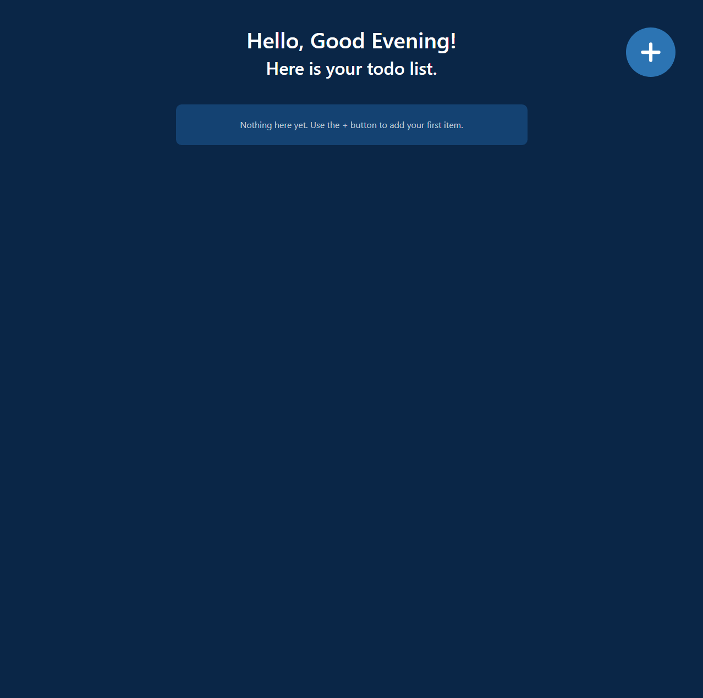
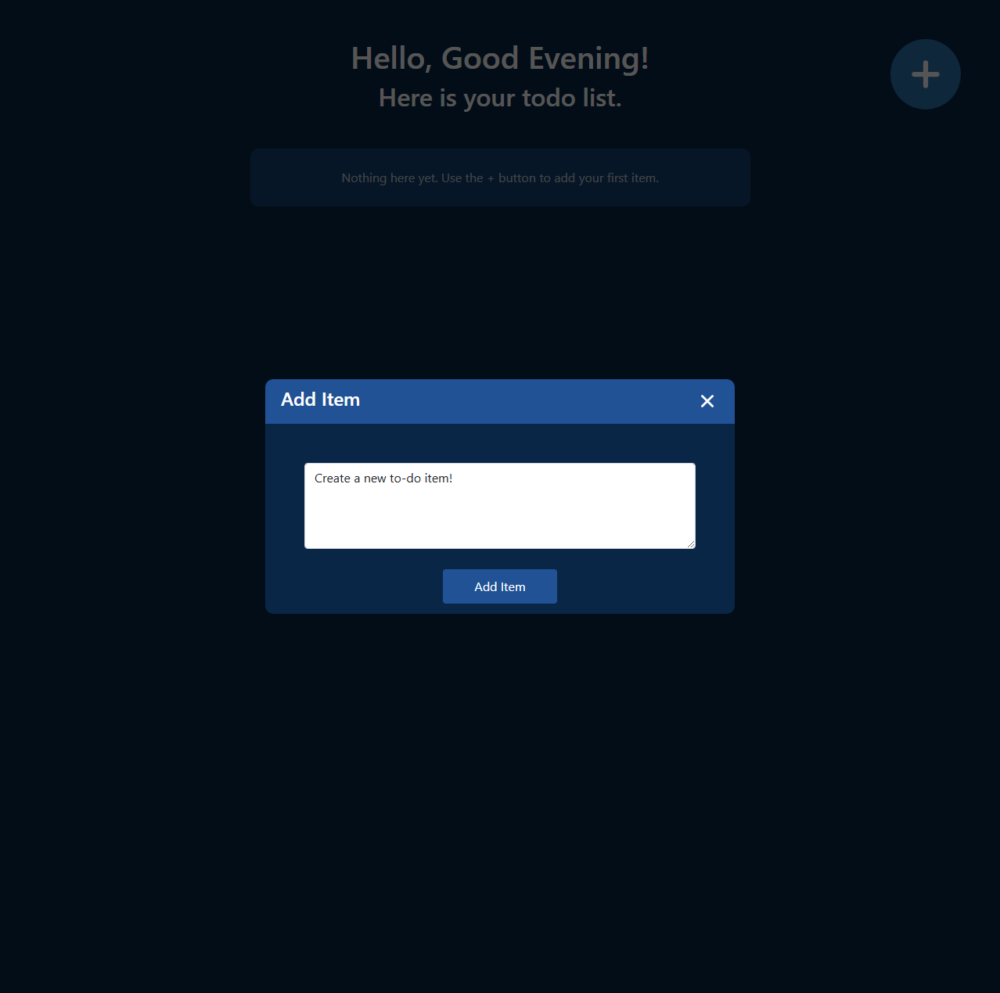
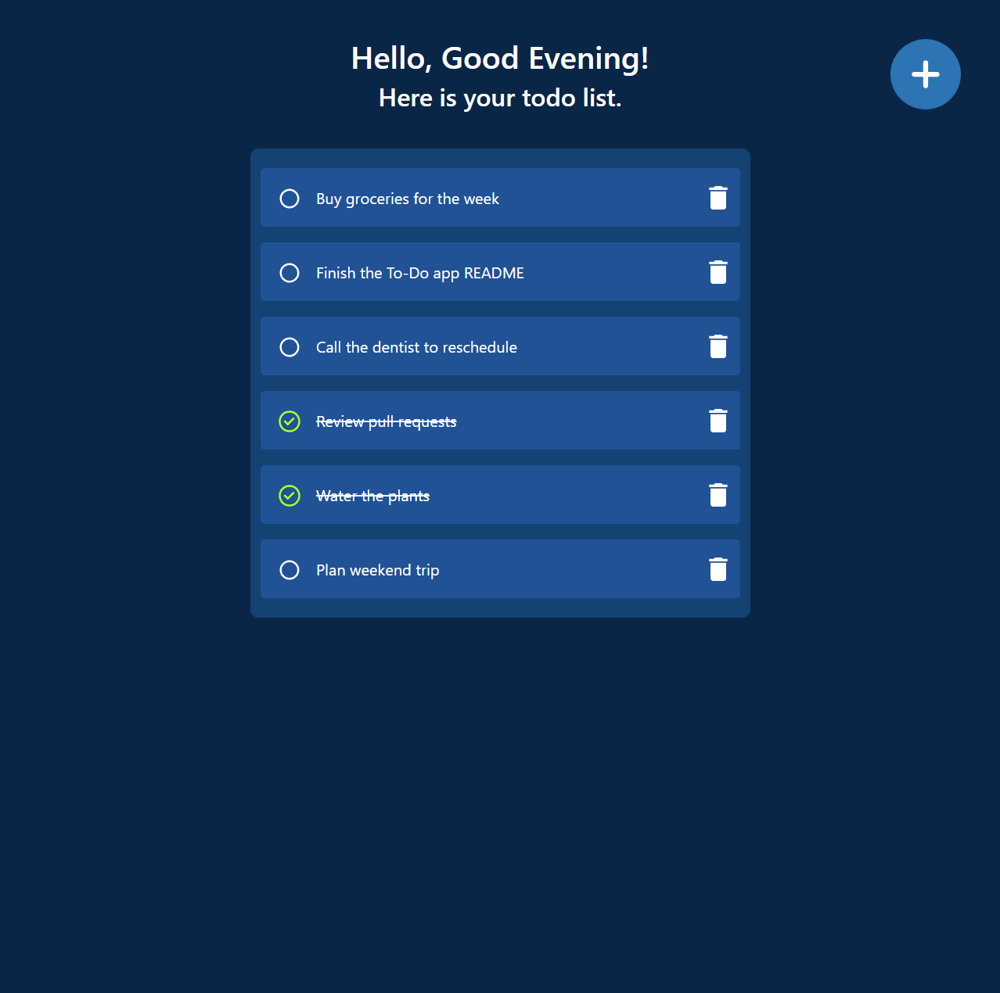

# To-Do

A full-stack to-do list app built with the MERN stack. Add items through a
popup, mark them complete, delete them, and everything persists to MongoDB.
Includes full CRUD: create, read, update (toggle complete), and delete.

### Live Demo
https://my-to-do-cil7.onrender.com

## Features

- Add a new item via a popup form
- Mark an item complete/incomplete with a click (strikethrough + check icon)
- Delete an item
- Success alert on add/delete
- Empty state when the list has no items
- Greeting that changes with the time of day (Morning/Afternoon/Evening)

## Tech Stack

**Frontend**
- React 18, Create React App
- Axios
- Bootstrap 5
- Iconify (`@iconify/react`) for icons

**Backend**
- Node.js with Express
- MongoDB with Mongoose
- CORS, body-parser, dotenv

## Project Structure

```
To-Do/
├── backend/              Express API server
│   ├── models/           Mongoose schema (Todo)
│   └── server.js         API routes and server entry point
├── frontend/              React app (Create React App)
│   └── src/
│       ├── components/    AddItem, Popup, ListItem, CheckIcon,
│       │                  UncheckIcon, DeleteIcon, Alert, Greet
│       └── App.js          App state and API calls
└── screenshots/           App screenshots, referenced below
```

## API Endpoints

| Method | Route | Description |
|---|---|---|
| GET | `/todos` | Fetch all todo items |
| POST | `/todos/new` | Create a todo (`{ text: string }` in the body) |
| PATCH | `/todos/complete/:id` | Toggle an item's completed status |
| DELETE | `/todos/delete/:id` | Delete an item |

## Getting Started

### Prerequisites
- Node.js
- A running MongoDB instance

### Run the API
```
cd backend
npm install
```
Create a `.env` file in `backend/`:
```
PORT=4000
DB_URI=your_mongodb_connection_string
```
```
npm start
```
The API listens on `http://localhost:4000`.

### Run the frontend
The frontend calls the API at a hardcoded `http://localhost:4000`, so the
backend must be running on port 4000 first:
```
cd frontend
npm install
npm start
```
The app is available at `http://localhost:3000` (or the next free port CRA
picks).

## Screenshots

### Empty list


### Add item


### Todo list

